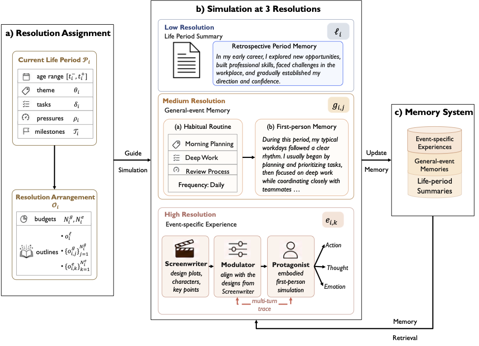

# MemoryForge

**Synthesizing Complete Autobiographical Memory Bases from Brief Persona Descriptions**

MemoryForge is a multi-stage pipeline that takes a one-sentence persona description π and produces a structured **Autobiographical Memory Base** M_π = (L, G, E), containing Lifetime Periods, General Events, and Event-Specific Knowledge grounded in cognitive-science models of human autobiographical memory.

<p align="center">
  
</p>


## Architecture Overview

The synthesis follows the joint factorisation:

```
p(M_π | π) = p_ctx(c | π) · p_org(P | c, π) · ∏ p_sim(ℓ_i, G_i, E_i | P_{≤i}, c, π)
```

which decomposes into three core components:

| Component | Factor | Role |
|-----------|--------|------|
| **Context Generator** | p_ctx(c \| π) | Ensures *contextual realism*: expands a brief description into a full simulation seed c = (ϕ, σ, R) |
| **Life Organizer** | p_org(P \| c, π) | Ensures *persona alignment*: partitions the lifespan into developmentally-grounded periods |
| **Multi-Resolution Simulator** | ∏ p_sim | Ensures *computational efficiency*: generates memories at three resolution levels |


## Pipeline Stages

### Component 1: Context Generator

| Stage | Sub-step | Code Module | Description |
|-------|----------|-------------|-------------|
| **Personal Context** | Infer demographic anchors ϕ from π | `simulation_p0_persona_settings/` | Validates persona fields and auto-infers missing attributes (name, age, location, culture, values) |
| **Social Context** | Generate socio-cultural timeline σ and social network R | `simulation_p1_initialisation/participant_pool.py` | Builds a socially-grounded supporting character network with temporal briefs |
| **Year Enrichment** | Generate per-year contextual enrichment | `simulation_p1_initialisation/key_life_path_generator.py` | Pre-generates year-level real-world cultural/historical context |

### Component 2: Life Organizer

| Stage | Sub-step | Code Module | Description |
|-------|----------|-------------|-------------|
| **Life Milestone Generation** | (π, c) → T = {(t_m, μ_m)} | `simulation_p1_initialisation/milestone_planner.py` | Generates trajectory milestones that justify the final identity |
| **Life Period Partition** | (π, c, T) → P = (P_1, ..., P_P) | `simulation_p1_initialisation/life_period_planner.py` | Development-aware period planning with temporal anchoring |

### Component 3: Multi-Resolution Simulator

| Stage | Sub-step | Code Module | Description |
|-------|----------|-------------|-------------|
| **Resolution Arrangement** | Outline budget O_i per period | `simulation_p2_event_organiser/event_organiser.py` | Assigns slot counts (N^g, N^e) per period; applies childhood amnesia & recency window |
| **Low-Resolution Simulation** | o^ℓ_i → ℓ_i | `simulation_p2_event_organiser/event_organiser.py` | Generates retrospective lifetime period summaries (L) |
| **Medium-Resolution Simulation** | o^g → g (habitual routines) | `simulation_p2_event_organiser/event_organiser.py` | Generates general-event memories from routine seeds (G) |
| **High-Resolution Simulation** | o^e → e (multi-agent scenes) | `simulation_p3_multi_resolution_simulation/high_res_event_simulator.py` | Runs Screenwriter → Modulator → Protagonist multi-agent loop for event-specific episodes (E) |
| **Memory System** | Write + Read (retrieval during sim) | `simulation_p4_memory_organiser/` | Manages memory write-back after each period; query-routed retrieval during high-res simulation |


## Repository Structure

```
MemoryForge/
├── run_MemoryForge.py                          # Unified pipeline entry point
├── figs/
│   └── f2.png                                  # Pipeline architecture figure
├── lifelong_synth/                             # Core synthesis modules
│   ├── configs/
│   │   ├── persona_schema.json                 # Persona field schema & validation rules
│   │   ├── initialise_configs.py               # Initialisation configuration
│   │   ├── simulation_quality.py               # Quality control parameters
│   │   └── temporal_context.py                 # Temporal density & period resolution computation
│   ├── performance_tracker.py                  # Stage-level performance metrics
│   ├── persona_extensions_formatter.py         # Persona extension formatting utilities
│   │
│   │── [Context Generator]
│   ├── simulation_p0_persona_settings/         # Personal Context Generation (ϕ inference)
│   │   ├── definition.py                       # PersonaInputSchema type definitions
│   │   └── sample_refiner.py                   # One-shot demographic anchor inference
│   │
│   │── [Life Organizer + Context Generator (Social)]
│   ├── simulation_p1_initialisation/           # Life planning + social context
│   │   ├── definition.py                       # Data models (planner + participant pool)
│   │   ├── life_period_planner.py              # Life Period Partition (P generation)
│   │   ├── milestone_planner.py                # Life Milestone Generation (T generation)
│   │   ├── key_life_path_generator.py          # Year-level socio-cultural enrichment (σ)
│   │   ├── key_life_path_models.py             # Key life path data models
│   │   └── participant_pool.py                 # Social Network initialisation (R)
│   │
│   │── [Multi-Resolution Simulator]
│   ├── simulation_p2_event_organiser/          # Resolution Arrangement + Low/Medium-Res
│   │   ├── definition.py                       # Event data models & constants
│   │   └── event_organiser.py                  # Budget allocation, LR/MR event generation
│   ├── simulation_p3_multi_resolution_simulation/  # High-Resolution Simulation
│   │   ├── definition.py                       # Participant refinement models
│   │   └── high_res_event_simulator.py         # Screenwriter/Modulator/Protagonist loop
│   │
│   │── [Memory System]
│   └── simulation_p4_memory_organiser/         # Memory write-back + retrieval
│       ├── definition.py                       # MemoryBase & EventRecord models
│       ├── embedding_engine.py                 # Embedding computation for retrieval
│       ├── fragment_scorer.py                  # Memory fragment salience scoring
│       ├── memory_manager.py                   # Core memory CRUD & M_π export
│       ├── memory_retriever.py                 # Query-routed top-k retrieval (Read)
│       └── write_pipeline.py                   # Memory write & consolidation (Write)
│
└── llm/                                        # LLM client infrastructure
    ├── __init__.py
    └── client.py                               # Async client: AIMD rate limiting,
                                                # structured output parsing, smart retry
```

## Requirements

- Python 3.9+
- Dependencies:

```bash
pip install litellm pydantic tenacity httpx
```

## Quick Start

### Basic Usage

```bash
# Set environment variables
export OPENAI_API_BASE="https://your-api-endpoint/v1"
export OPENAI_API_KEY="your-api-key"

# Run with a persona description
PYTHONPATH=. python run_MemoryForge.py \
    --persona "a 35-year-old marine biologist in Sydney who loves hiking"
```